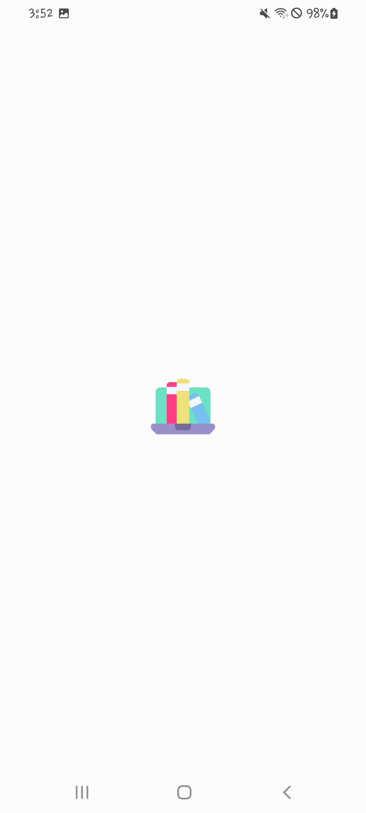
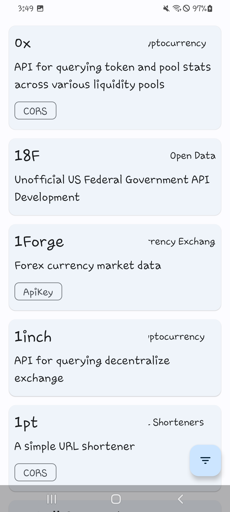
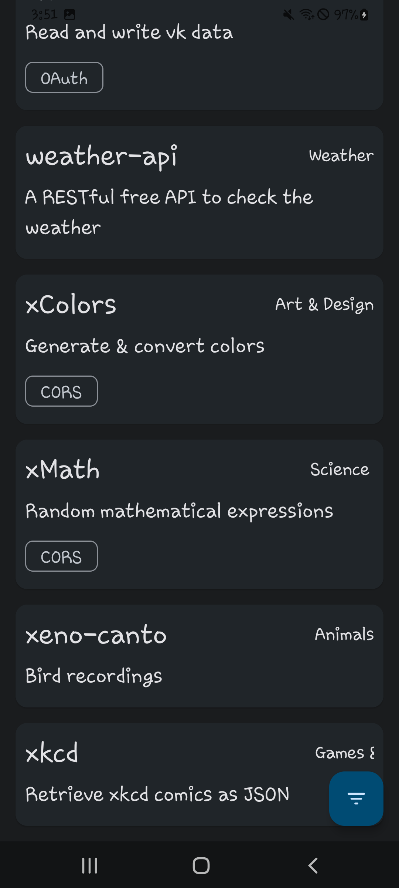

# [ApiLibrary] Duckie Architecture Sample Project 

 

이 프로젝트는 [public-api](https://github.com/davemachado/public-api) 로 부터 무료 API 들을 조회해서 보여주는 간단한 앱 입니다.
총 1천개가 넘는 무료 API 들을 보여줍니다. 덕키 아키텍처 샘플 용도로 제작됐습니다.

---

### Preview

|           Splash (Light Mode)            |                  Light Mode                  |                  Dark Mode                  |
| :--------------------------------------: | :------------------------------------------: | :-----------------------------------------: |
|  |  |  |

### Maintainer

- [Ji Sungbin](https://www.linkedin.com/in/ji-sungbin-4343b7219/)

### Download

- [1.0.0](https://github.com/duckie-team/ApiLibrary/releases/tag/1.0.0)

### Tech Stacks

- [Jetpack Compose](https://developer.android.com/jetpack/compose)
- [Material 3](https://m3.material.io/)
- [AAC Room](https://developer.android.com/jetpack/androidx/releases/room)
- [Dagger-Hilt](https://dagger.dev/hilt/)
- [Ktor Client](https://ktor.io/docs/getting-started-ktor-client.html)
- [Kotlin Coroutines](https://kotlinlang.org/docs/coroutines-overview.html)
- [Turbine](https://github.com/cashapp/turbine)
- [Strikt](https://strikt.io/)

### Architecture

[duckie-app/architecture.md](https://github.com/duckie-team/duckie-app/blob/develop/documents/architecture.md#apilibrary) 에서 확인하실 수 있습니다.

### License

이 프로젝트는 MIT 라이선스를 따릅니다. 자세한 내용은 [LICENSE](https://github.com/duckie-team/ApiLibrary/blob/trunk/LICENSE) 파일을 참고해 주세요.
